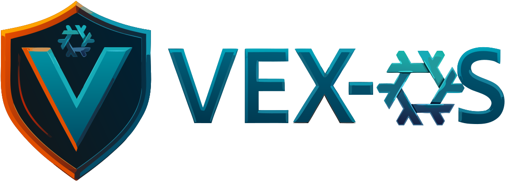
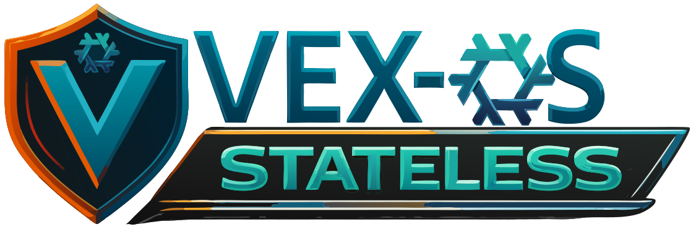
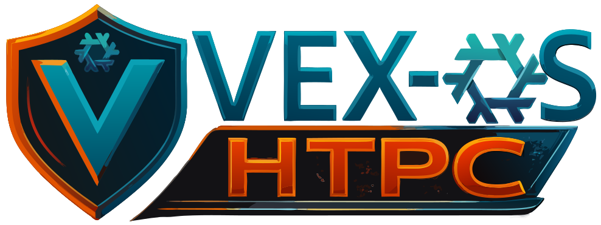

<div align="center">
   
</div>

<div align="center">

# vexos-nix

</div>

Personal NixOS config (GNOME, PipeWire, latest kernel). 
Comes in five roles:
**Desktop** (full gaming/workstation stack), 
**Stateless** (impermanent, minimal build, security-focused), 
**Server** (GUI & Headless service stack), 
**HTPC** (media center build). 
No cloning required — `/etc/nixos` is the only working directory you need.

Each role utilizes "just" to give a variety of options. Simply type "just" in a terminal to see the options.


## Fresh install

> Assumes NixOS is installed and `hardware-configuration.nix` already exists at `/etc/nixos/`.

**1. Drop the flake wrapper into `/etc/nixos`**
   ```bash
sudo curl -fsSL -o /etc/nixos/flake.nix \
  https://raw.githubusercontent.com/VictoryTek/vexos-nix/main/template/etc-nixos-flake.nix
   ```

**2. Apply your role and GPU variant**

```bash
curl -fsSL https://raw.githubusercontent.com/VictoryTek/vexos-nix/main/scripts/install.sh | bash
```


The script asks which role and which GPU variant to install (AMD, NVIDIA, Intel, or VM), runs the build, and offers to reboot when complete. After this first build, `/etc/nixos/vexos-variant` is written automatically and kept in sync on every future rebuild.


## How it works

`/etc/nixos/flake.nix` is a tiny wrapper that pulls the full config from GitHub. Your `hardware-configuration.nix` never leaves `/etc/nixos`. On every rebuild NixOS uses the pinned version in `/etc/nixos/flake.lock`.

The running config writes `/etc/nixos/vexos-variant` (a one-line file, e.g. `vexos-desktop-amd`) on every build so tooling like vexos-updater "Up" always knows which variant is active.


## Variants
# Switching variants

You can switch between variants (and roles) at any time — no reinstall required. Simply rebuild with the new variant target using "just":


<div align="center">
   
</div>

### Desktop role — full gaming/workstation stack

| Variant | Use for |
|---|---|
| `vexos-desktop-amd` | AMD GPU (RADV, ROCm, LACT) |
| `vexos-desktop-nvidia` | NVIDIA GPU (proprietary, open kernel modules) |
| `vexos-desktop-nvidia-legacy535` | NVIDIA Maxwell/Pascal/Volta legacy — LTS alternative (535.x driver) |
| `vexos-desktop-nvidia-legacy470` | NVIDIA Kepler legacy — GeForce 600/700 series (470.x driver) |
| `vexos-desktop-intel` | Intel iGPU or Arc dGPU |
| `vexos-desktop-vm` | QEMU/KVM or VirtualBox guest |

> just switch vexos-desktop-(gpu-choice)


<div align="center">
   
</div>

### Stateless role — minimal build (no gaming / dev / virt / ASUS)

| Variant | Use for |
|---|---|
| `vexos-stateless-amd` | AMD GPU, minimal stack |
| `vexos-stateless-nvidia` | NVIDIA GPU, minimal stack |
| `vexos-stateless-nvidia-legacy535` | NVIDIA Maxwell/Pascal/Volta legacy, minimal stack |
| `vexos-stateless-nvidia-legacy470` | NVIDIA Kepler legacy — GeForce 600/700 series, minimal stack |
| `vexos-stateless-intel` | Intel iGPU or Arc dGPU, minimal stack |
| `vexos-stateless-vm` | QEMU/KVM or VirtualBox guest, minimal stack |

> just switch vexos-stateless-(gpu-choice)


<div align="center">
   
</div>

### GUI Server role — GNOME desktop + service stack

| Variant | Use for |
|---|---|
| `vexos-server-amd` | AMD GPU |
| `vexos-server-nvidia` | NVIDIA GPU |
| `vexos-server-nvidia-legacy535` | NVIDIA Maxwell/Pascal/Volta legacy |
| `vexos-server-nvidia-legacy470` | NVIDIA Kepler legacy — GeForce 600/700 series |
| `vexos-server-intel` | Intel iGPU or Arc dGPU |
| `vexos-server-vm` | QEMU/KVM or VirtualBox guest |

### Headless Server role — CLI only service stack

| Variant | Use for |
|---|---|
| `vexos-headless-server-amd` | AMD GPU |
| `vexos-headless-server-nvidia` | NVIDIA GPU |
| `vexos-headless-server-nvidia-legacy535` | NVIDIA Maxwell/Pascal/Volta legacy |
| `vexos-headless-server-nvidia-legacy470` | NVIDIA Kepler legacy — GeForce 600/700 series |
| `vexos-headless-server-intel` | Intel iGPU or Arc dGPU |
| `vexos-headless-server-vm` | QEMU/KVM or VirtualBox guest |

> just switch vexos-server-(gpu-choice)


<div align="center">
   
</div>

### HTPC role — media centre build

| Variant | Use for |
|---|---|
| `vexos-htpc-amd` | AMD GPU |
| `vexos-htpc-nvidia` | NVIDIA GPU |
| `vexos-htpc-nvidia-legacy535` | NVIDIA Maxwell/Pascal/Volta legacy |
| `vexos-htpc-nvidia-legacy470` | NVIDIA Kepler legacy — GeForce 600/700 series |
| `vexos-htpc-intel` | Intel iGPU or Arc dGPU |
| `vexos-htpc-vm` | QEMU/KVM or VirtualBox guest |

> just switch vexos-htpc-(gpu-choice)


> **Switching GPU drivers?** A reboot is recommended after switching between AMD, NVIDIA, and Intel variants so the kernel modules load cleanly.


## Updating to the latest config

If the updater "Up" fails for any reason you can run "just update" or run the command below to sync back up with the github flake.

```bash
cd /etc/nixos && sudo nix flake update
sudo nixos-rebuild switch --flake /etc/nixos#$(cat /etc/nixos/vexos-variant)
```


## Notes
```bash
sudo nix --extra-experimental-features 'nix-command flakes' flake update --flake /etc/nixos


## Rollback

```bash
sudo nixos-rebuild switch --rollback

Set Nixos back to default configuration:
sudo rm -f /etc/nixos/flake.nix /etc/nixos/flake.lock && sudo nixos-generate-config --root / && sudo nixos-rebuild switch
```
